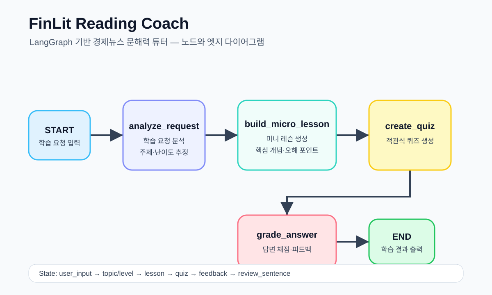

# FinLit Reading Coach — LangGraph Assignment

교육 & 학습 테마의 LangGraph 과제 제출용 프로젝트입니다.

## 1. 에이전트 설계

### 이름

FinLit Reading Coach — 경제뉴스 문해력 튜터

### 목적

경제뉴스, 공시, 재무제표처럼 초보자가 어렵게 느끼는 금융 정보를 학습자의 수준에 맞춰 설명하고, 핵심 개념·오해 포인트·퀴즈·복습 문장으로 바꾸어 금융문해력을 기르는 것을 목표로 합니다.

이 에이전트는 뉴스를 대신 요약해주는 도구가 아니라, 사용자가 경제 정보를 스스로 읽고 이해하는 힘을 기르도록 돕는 교육용 튜터입니다.

## 2. 해결하려는 문제

경제뉴스는 매일 쏟아지지만, 초보 학습자는 다음을 놓치기 쉽습니다.

- 이 뉴스가 왜 중요한지
- 어떤 경제 개념과 연결되는지
- 숫자와 정책 변화가 내 생활과 어떤 관계가 있는지
- 기사 문장을 자기 말로 다시 설명할 수 있는지

FinLit Reading Coach는 어려운 경제 문장을 짧은 학습 세션으로 바꾸어, 학습자가 경제뉴스를 천천히 읽는 연습을 할 수 있도록 돕습니다.

## 3. 핵심 기능

### 1) 학습 요청 분석 및 경로 선택

사용자가 입력한 경제뉴스 문장 또는 학습 요청에서 핵심 주제와 학습 난이도를 추정합니다.
이후 사용자 입력에 "개념", "뜻", "금리", "환율", "물가", "공시"처럼 보강 설명이 필요한 단어가 있으면 Tool 보강 경로로 보내고, 일반 학습 요청이면 바로 미니 레슨 경로로 보냅니다.

예시 입력:
- 초보자에게 기준금리 동결 뉴스를 쉽게 설명해줘

예시 분석 결과:
- 주제: 기준금리
- 난이도: 입문

### 2) 미니 레슨 생성

주제에 맞는 짧은 학습 콘텐츠를 생성합니다.

구성:
- 오늘 읽을 문장
- 핵심 개념
- 그냥 읽으면 놓치는 포인트
- 나와의 연결
- 한 줄 복습

### 3) 여러 Tool 기반 학습 보강

커스텀 Tool인 `lookup_finlit_concept`를 사용해 기준금리, 환율, 물가, 기업공시 같은 핵심 금융 개념 설명을 찾아 레슨에 추가합니다.
또 다른 커스텀 Tool인 `suggest_review_activity`를 사용해 학습 난이도에 맞는 복습 활동을 추천합니다.

### 4) 병렬 복습 카드 생성

Send API를 사용해 핵심 개념, 오해 포인트, 생활 연결 복습 카드를 병렬로 생성합니다.

### 5) 프롬프트 체이닝

`build_lesson_prompt`와 `build_quiz_prompt` 노드가 앞 단계의 분석·도구·레슨·복습 카드 결과를 받아 다음 단계 프롬프트를 구성합니다.
생성된 프롬프트 이력은 `prompt_chain`에 저장되어 CLI, 테스트, Streamlit UI에서 확인할 수 있습니다.

### 6) 퀴즈 생성

학습 내용을 확인할 수 있는 객관식 퀴즈를 만듭니다.

### 7) 답변 피드백

사용자의 답변을 채점하고, 왜 그 답이 맞는지 또는 틀렸는지 설명합니다.

### 8) AI-as-judge 평가

`ai_as_judge_evaluate` 노드가 레슨, 퀴즈, 피드백 품질을 루브릭으로 평가합니다.
평가 항목은 학습 주제 반영, 레슨 구조, 퀴즈 품질, 피드백 품질이며 결과는 `judge_scores`, `judge_feedback`, `judge_passed`에 저장됩니다.

### 9) Streamlit 채팅 UI

`streamlit_app.py`는 기본 채팅 인터페이스를 제공합니다.
사용자는 학습 요청을 입력하고, 에이전트는 프롬프트 체이닝·미니 레슨·병렬 복습 카드·퀴즈·피드백·한 줄 복습·AI-as-judge 평가를 한 번에 보여줍니다.
이후 A/B/C/D 답변을 입력하면 같은 학습 요청에 대한 퀴즈 답변으로 채점할 수 있습니다.

## 4. LangGraph 그래프 구조

아래 흐름도는 FinLit Reading Coach의 기본 LangGraph 구조입니다.

~~~mermaid
flowchart TD
    START([START]) --> A[analyze_request 학습 요청 분석]
    A --> R{route_learning_path Conditional Edge}
    R -->|use_tool| T[enrich_with_tool 커스텀 Tool 2개 호출]
    R -->|direct_lesson| LP[build_lesson_prompt 레슨 프롬프트 생성]
    T --> LP
    LP --> B[build_micro_lesson 미니 레슨 생성]
    B --> S{dispatch_review_tasks Send API 병렬 분배}
    S --> P1[build_practice_card 핵심 개념 카드]
    S --> P2[build_practice_card 오해 포인트 카드]
    S --> P3[build_practice_card 생활 연결 카드]
    P1 --> QP[build_quiz_prompt 퀴즈 프롬프트 생성]
    P2 --> QP
    P3 --> QP
    QP --> C[create_quiz 퀴즈 생성]
    C --> D[grade_answer 답변 피드백]
    D --> J[ai_as_judge_evaluate AI-as-judge 평가]
    J --> END([END])
~~~

흐름 요약:

START → analyze_request → route_learning_path → enrich_with_tool 또는 build_lesson_prompt → build_micro_lesson → Send API 병렬 복습 카드 생성 → build_quiz_prompt → create_quiz → grade_answer → ai_as_judge_evaluate → END

텍스트 흐름도:

[START]
   |
   v
[analyze_request]
학습 요청 분석
   |
   v
[route_learning_path]
사용자 입력에 따라 Tool 보강 여부 결정
   |
   +-- use_tool --> [enrich_with_tool]
   |                 커스텀 Tool로 개념 설명 보강
   |                 |
   |                 v
   +-----------> [build_lesson_prompt]
                레슨 프롬프트 생성
                  |
                  v
[build_micro_lesson]
                미니 레슨 생성
                  |
                  v
[dispatch_review_tasks]
Send API로 복습 카드 병렬 분배
   |
   v
[build_practice_card]
핵심 개념 / 오해 포인트 / 생활 연결 카드 생성
   |
   v
[build_quiz_prompt]
퀴즈 프롬프트 생성
   |
   v
[create_quiz]
퀴즈 생성
   |
   v
[grade_answer]
답변 피드백
   |
   v
[ai_as_judge_evaluate]
AI-as-judge 루브릭 평가
   |
   v
[END]

## 5. 노드 설명

| 노드 | 역할 |
|---|---|
| analyze_request | 사용자 입력에서 학습 주제와 난이도를 추정합니다. |
| enrich_with_tool | 커스텀 Tool 2개를 호출해 금융 개념 설명과 복습 활동을 보강합니다. |
| build_lesson_prompt | 분석 결과와 도구 결과를 받아 미니 레슨 생성을 위한 프롬프트를 만듭니다. |
| build_micro_lesson | 주제에 맞는 미니 레슨과 한 줄 복습 문장을 생성합니다. |
| build_practice_card | Send API로 병렬 실행되어 복습 카드를 생성합니다. |
| build_quiz_prompt | 레슨과 병렬 복습 카드 결과를 받아 퀴즈 생성을 위한 프롬프트를 만듭니다. |
| create_quiz | 학습 내용을 확인하는 객관식 퀴즈를 생성합니다. |
| grade_answer | 사용자의 답변을 채점하고 피드백을 제공합니다. |
| ai_as_judge_evaluate | 레슨, 퀴즈, 피드백 품질을 루브릭으로 평가합니다. |

## 6. State 정의

TutorState는 다음 정보를 관리합니다.

- user_input
- topic
- level
- route
- prompt_chain
- tool_result
- review_activity
- lesson
- quiz
- practice_cards
- answer
- feedback
- review_sentence
- judge_scores
- judge_feedback
- judge_passed

그래프는 `InMemorySaver` 체크포인터와 함께 컴파일되어 `thread_id` 기준으로 실행 상태를 저장합니다.

## 7. 실행 방법

의존성 설치:

    uv sync

CLI 실행:

    uv run python main.py

Streamlit UI 실행:

    uv run streamlit run streamlit_app.py

테스트:

    uv run pytest -q

unittest만 실행:

    uv run python -m unittest

## 8. 과제 요구사항 충족 여부

| 요구사항 | 충족 여부 |
|---|---|
| LangGraph 사용 | 충족 |
| State 정의 | 충족 |
| 최소 3개 노드 구현 | 충족 — 9개 노드 구현 |
| Conditional Edge 구현 | 충족 — `route_learning_path`가 `use_tool` 또는 `direct_lesson` 경로를 선택 |
| Tool 연동 | 충족 — `lookup_finlit_concept`, `suggest_review_activity` 커스텀 Tool 연동 |
| 고급 패턴 | 충족 — Option B 워크플로우 아키텍처와 Option C 테스트 구현 |
| 병렬 실행 | 충족 — Send API로 복습 카드 3개를 병렬 생성 |
| 메모리 기능 | 충족 — `InMemorySaver` 체크포인터와 `thread_id` 사용 |
| 여러 개의 Tool 연동 | 충족 — 2개 Tool 연동 |
| Streamlit UI | 충족 — `streamlit_app.py` 기본 채팅 인터페이스 추가 |
| 기본 그래프 연결 | 충족 |
| 실행 가능한 코드 | 충족 |
| 교육 & 학습 테마 | 충족 |

## 9. 고급 패턴 및 테스트 검증 결과

이번 제출물은 필수 조건인 "최소 1개의 고급 패턴"을 넘어 Option B와 Option C를 함께 구현합니다.
아래 표는 과제에서 제시된 Option B, Option C 세부 항목별 실제 구현 여부입니다.

| 항목 | 상태 | 확인 내용 |
|---|---|---|
| Option B: 워크플로우 아키텍처 | 충족 | LangGraph StateGraph로 학습 요청 분석 → 경로 선택 → 도구 보강 → 레슨 프롬프트 → 미니 레슨 → 복습 카드 → 퀴즈 프롬프트 → 퀴즈 → 채점 → 평가 흐름을 구성했습니다. |
| Prompt Chaining | 충족 | `build_lesson_prompt`와 `build_quiz_prompt`가 이전 노드 결과를 받아 다음 생성 단계의 프롬프트를 만들고, `prompt_chain`에 이력을 저장합니다. |
| Parallelization | 충족 | `dispatch_review_tasks`가 LangGraph `Send` API로 핵심 개념, 오해 포인트, 생활 연결 복습 카드 생성을 병렬 분배합니다. |
| Orchestrator-Workers | 충족 | `dispatch_review_tasks`가 오케스트레이터 역할을 하고, `build_practice_card`가 각 복습 카드 작업을 처리하는 워커 역할을 합니다. |
| Option C: 테스트 | 충족 | `unittest` 테스트와 PyTest 노드 테스트를 함께 제공합니다. |
| PyTest를 활용한 노드 테스트 | 충족 | `test_nodes_pytest.py`에서 `analyze_request`, 프롬프트 체이닝 노드, AI-as-judge 노드, 전체 그래프 실행을 PyTest로 검증합니다. |
| AI-as-judge 평가 | 충족 | `ai_as_judge_evaluate` 노드가 레슨 주제 반영, 레슨 구조, 퀴즈 품질, 피드백 품질을 루브릭으로 평가합니다. |
| Streamlit UI 동작 확인 | 충족 | `uv run streamlit run streamlit_app.py --server.headless true --server.port 8502`로 서버 실행 후 브라우저에서 채팅 입력, 프롬프트 체이닝, 미니 레슨, 병렬 복습 카드, 퀴즈, AI-as-judge 평가 렌더링을 확인했습니다. |
| 자동 테스트 실행 결과 | 통과 | `uv run pytest -q` 실행 결과 15개 테스트가 모두 통과했습니다. |

정리하면, 채점 기준상 구현한 고급 패턴은 Option B의 `Prompt Chaining`, `Parallelization`, `Orchestrator-Workers`와 Option C의 `PyTest 노드 테스트`, `AI-as-judge 평가`입니다.

## 10. 향후 확장 아이디어

- 실제 경제뉴스 제목을 입력받아 학습 세션 생성
- 공시 문장을 학습용 문장으로 변환
- 재무제표 숫자 해석 퀴즈 생성
- 학습자의 오답 패턴 기반 복습 카드 생성
- FinLit 앱의 학습 기록 기능과 연결
- 실제 LLM judge를 연결해 루브릭 평가의 자연어 판단 품질 강화
